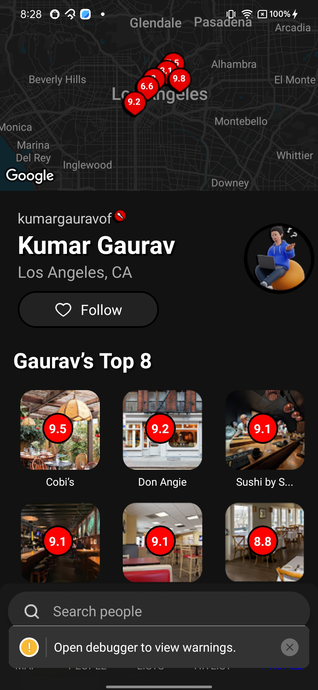
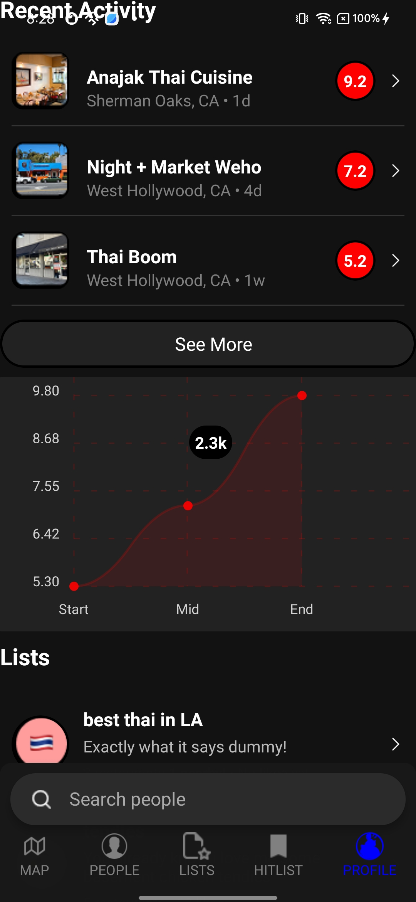
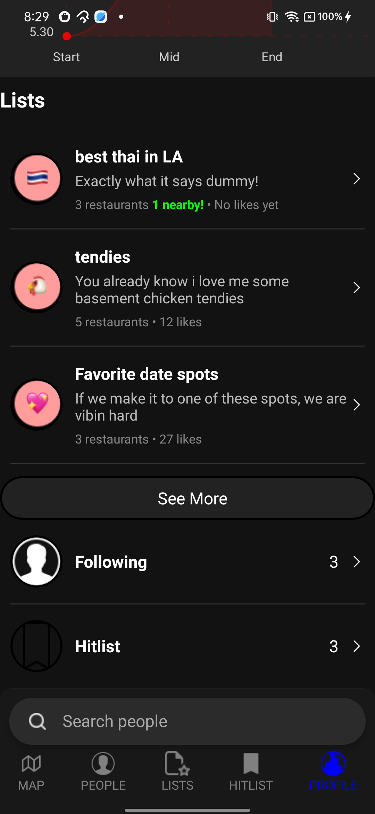
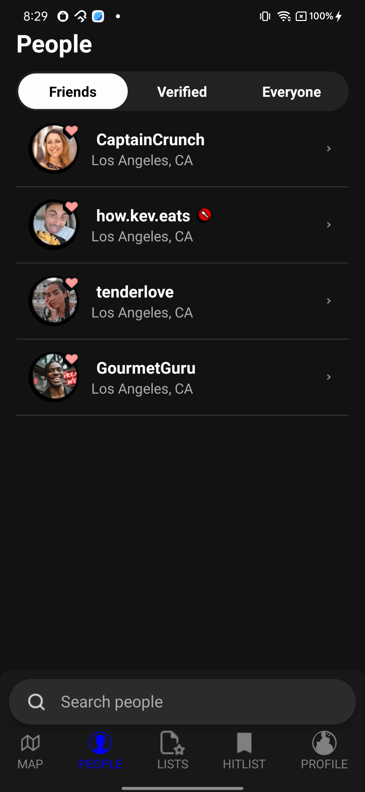

# React Native CLI Installation & Usage Guide

## Prerequisites
Ensure you have the following installed before setting up React Native:
- **Node.js** (Recommended: Latest LTS version) - [Download here](https://nodejs.org/)
- **Watchman** (for macOS, recommended for better performance) - [Installation Guide](https://facebook.github.io/watchman/docs/install)
- **Java Development Kit (JDK)** (for Android development) - Recommended: OpenJDK 17+
- **Android Studio** (for Android development, includes SDK, Emulator, and Build Tools)
- **Xcode** (for iOS development, macOS only) - Install via the Mac App Store

## Installation
Node Version
```sh
nvm install node@23.10.0
```

NPM Version 
10.9.2


### 1. Install React Native CLI
```sh
npm install -g react-native-cli
```
OR
```sh
npm install -g react-native@0.78.1
```

Install Node Module
```sh
nvm install
```

## Running the Application
### Android (Using Emulator or Connected Device)
Ensure you have an Android emulator running or a device connected:
```sh
npx react-native run-android
```

### iOS (macOS Only)
Ensure you have Xcode installed:
```sh
npx react-native run-ios
```

## Running Metro Bundler
Metro Bundler is the development server that compiles JavaScript:
```sh
npx react-native start
```

## Troubleshooting
### If you face issues with dependencies, try:
```sh
cd android && ./gradlew clean && cd ..
npx react-native start --reset-cache
```

### If iOS build fails, try:
```sh
cd ios && pod install && cd ..
npx react-native run-ios
```

## Additional Resources
- [Official React Native Docs](https://reactnative.dev/docs/environment-setup)
- [React Native GitHub](https://github.com/facebook/react-native)


#Application Screen Shot







